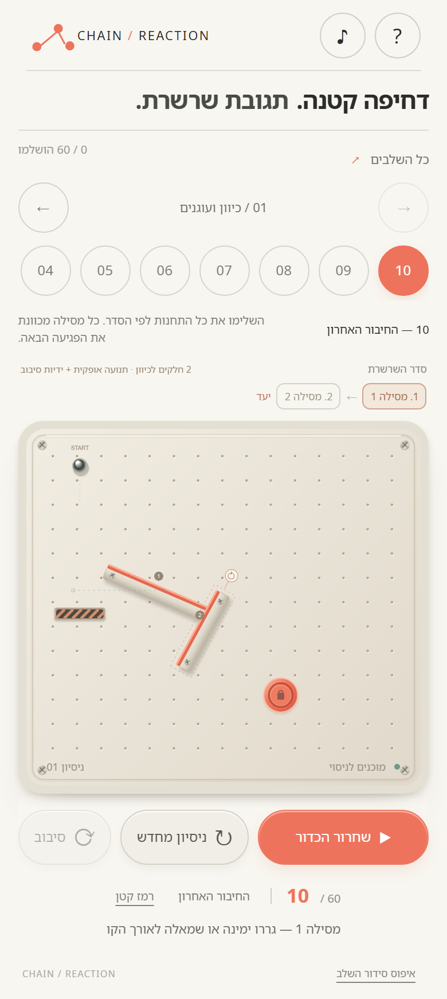
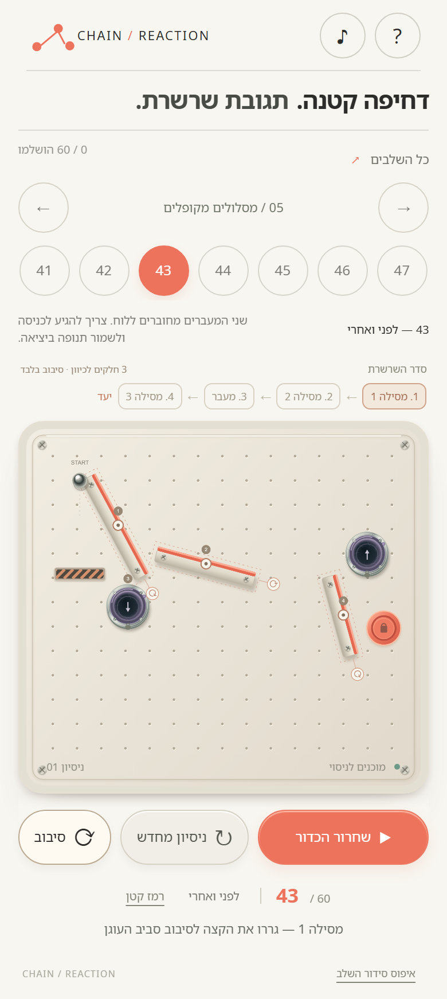
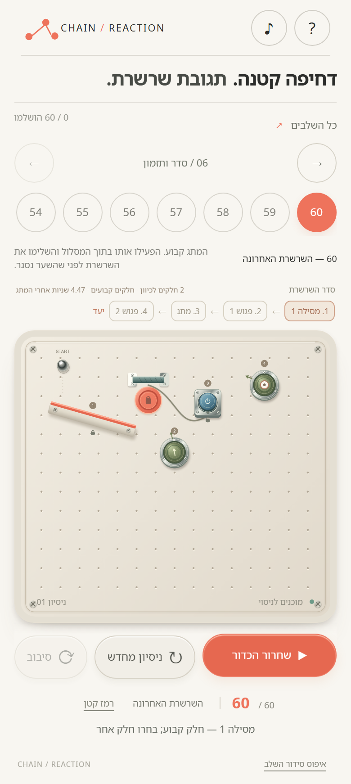

# CHAIN / REACTION

משחק פיזיקה לשחקן יחיד, שתוכנן למסך מגע: מסדרים כמה חלקים, משחררים כדור וצופים בתגובת שרשרת. 60 חידות בשישה פרקים, עם מסילות, דומינו, קפיצים, פגושי גומי, מעברים ומתגים.

**[הורדת APK חתום לאנדרואיד](https://github.com/3dFx40/chain-reaction/releases/latest)** · [בנייה של Android](docs/ANDROID.md) · [אימות החתימות](docs/SIGNING.md)

## תמונות משחק במובייל

תמונות ממשק המשחק ברוחב 390 פיקסלים בדפדפן. אותו ממשק ארוז באפליקציית Android; אלו אינן תמונות ממכשיר פיזי.

| שליטה במסילות | מעברים | השרשרת האחרונה |
| --- | --- | --- |
|  |  |  |

## התקנה באנדרואיד

1. הורידו את `chain-reaction-1.0.0.apk` מדף הגרסה.
2. פתחו את הקובץ במכשיר ואפשרו התקנה מהדפדפן או ממנהל הקבצים, אם Android מבקש זאת.
3. התקינו והפעילו **CHAIN / REACTION**.

נדרש Android 8 ומעלה ו־Android System WebView מעודכן. המשחק, הגופנים והשלבים נמצאים ב־APK. האפליקציה פועלת ללא חיבור, בלי חשבון ובלי הרשאת אינטרנט. ההתקדמות נשמרת במכשיר. עדכון עם אותו מזהה ואותה חתימה שומר את הנתונים; הסרת האפליקציה מוחקת אותם.

## איך משחקים

- גררו חלק נייד בתוך אזור ההצבה. קו מנחה מגביל תנועה לציר אחד.
- במסילה מעוגנת, גררו את הקצה לסיבוב סביב העוגן העגול. ידית עגולה מאפשרת סיבוב בחלקים נוספים.
- מנעול מסמן חלק קבוע. מתחת ללוח מופיעה הפעולה המותרת לחלק שבחרתם.
- השלימו את התחנות לפי הסדר ואז הגיעו ליעד. בשלב דומינו, החלק האחרון בשורה חייב ללחוץ על היעד.
- מחיצות עוצרות את הכדור; מלכודות מסיימות ניסיון. חלק מהמתגים פותחים שער לזמן מוגבל.
- ניסיון מחדש שומר את הסידור. איפוס סידור השלב מחזיר את המצב ההתחלתי.

הפרקים מציגים בהדרגה עוגנים, תנועה בציר, העברת תנופה, קפיצות, מסלולי חזרה, מעברים וסדר ותזמון. רמזים ומפת כל 60 השלבים זמינים בכל רגע.

## הפעלה בדפדפן

נדרש Node.js 20 ומעלה. לשרת ולמשחק אין תלויות npm.

```sh
npm start
```

פתחו [localhost:5173](http://localhost:5173). מקלדת: חצים להזזה, A/D לסיבוב, Tab לבחירת חלק כשהלוח ממוקד, רווח להפעלה, R לניסיון מחדש ו־F למסך מלא. גירסת הדפדפן תומכת בשמירה מקומית ובמטמון ללא חיבור לאחר טעינה ראשונה ב־HTTPS או ב־localhost.

## בדיקות

```sh
npm test
```

הבדיקה מריצה פתרון חוקי לכל 60 השלבים דרך מנגנון העריכה של השחקן. היא בודקת אילוצים, סדר, מחיצות, מלכודות, שערים, מניעת דילוג ליעד ואיפוס ניסיון.

בדיקות הממשק דורשות Playwright ו־Chromium, ושרת פעיל:

```sh
npm install --no-save playwright
npx playwright install chromium
node tests/browser.mjs
node tests/pivot-touch.mjs
node tests/touch-button.mjs
node tests/audit.mjs
```

`audit.mjs` משלים את כל 60 השלבים בעכבר ואת כל 60 השלבים באירועי מגע, ובודק ניסיון מחדש בכל שלב. הבדיקות עברו בכרומיום. בדיקות המגע הנוספות מכסות רוחב 390 ו־320. Android נבדק באמצעות קומפילציית release, Android Lint ואימות חתימת APK. התקנה וריצה במכשיר פיזי טרם נבדקו; אין מכשיר מחובר במחשב הבנייה.

GitHub Actions בונה ובודק את הפרויקט. APK ההורדה נחתם במפתח שחרור פרטי שאינו נמצא במאגר. ראו [הוראות בנייה](docs/ANDROID.md).

## מבנה הפרויקט

| קובץ / תיקייה | תפקיד |
| --- | --- |
| `game.js`, `device-art.js`, `puzzle-art.js` | ממשק, ציור חלקים ואפקטים |
| `physics-core.js`, `editor.js` | פיזיקה ב־120Hz ואילוצי עריכה |
| `level-data.js`, `scripts/design-levels.mjs` | הגדרות קבועות ו־60 תוכניות מסלול |
| `android/` | מעטפת Android וקבצים מקומיים דרך WebViewAssetLoader |
| `tests/` | בדיקות פיזיקה, מגע וממשק |
| `docs/` | תמונות, בנייה ואימות חתימות |

אין הגרלת שלבים או פתרון אוטומטי בזמן המשחק. קושי והנאה דורשים גם מבחני משחק עם אנשים.

## זכויות וקבצי צד שלישי

הקוד המקורי © 2026 3dFx40. המאגר ציבורי; לא הוענק לקוד המקורי רישיון קוד פתוח נפרד. פרטי הגופנים וכלי הצד השלישי נמצאים ב־[THIRD_PARTY_NOTICES.md](THIRD_PARTY_NOTICES.md).
